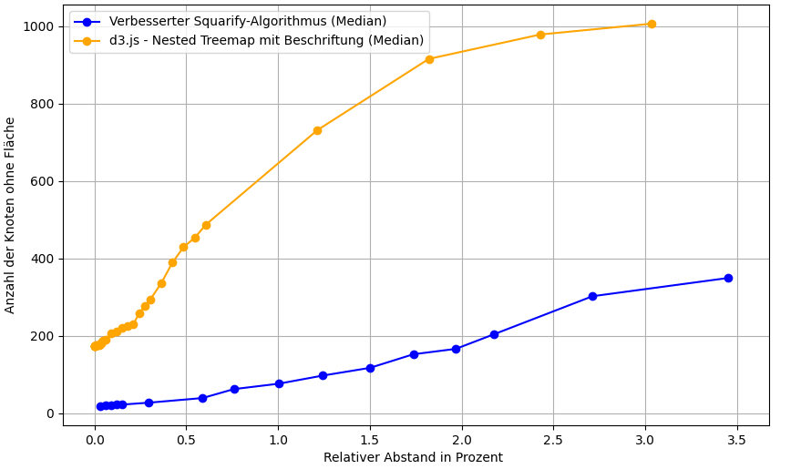
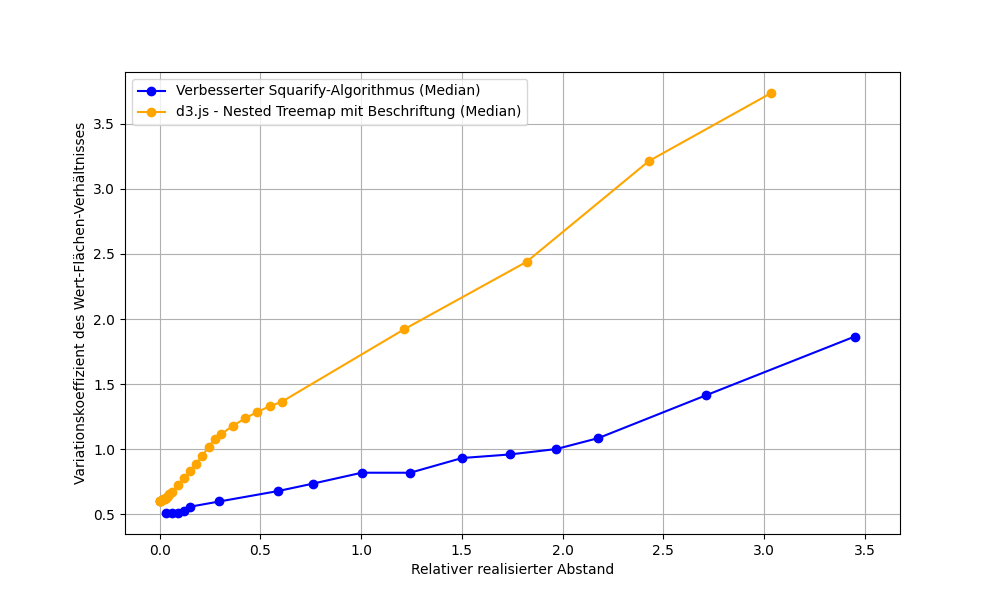

# area-true-treemap

> Area-true squarified treemap layout with configurable gaps between nodes — a drop-in replacement for
> d3-hierarchy's `treemap()` that does not lose nodes to its own padding.

<p align="center">
  <a href="https://benediktmehl.github.io/area-true-treemap/">
    
  </a>
</p>

Live demo, d3.js and area-true side by side with all settings:
<https://benediktmehl.github.io/area-true-treemap/>

## What is better

- **Fewer nodes disappear.** At the same gap d3 loses far more of them — and it already loses nodes when
  there is no gap at all (charts below).
- **Gaps are relative, not pixels.** `margin(0.02)` means 2 % of the map width, so one configuration is right on
  a thumbnail and on a 4K screen.
- **Labels, sibling-gap modes and folder collapsing are built in** — `floorLabels()`, `labelLength()`,
  `siblingMarginLeavesOnly()`, `collapseFolders()` — instead of glue code around the layout.
- **Drop-in for d3-hierarchy:** the same `hierarchy()` + `treemap()` calls, the same `x0/y0/x1/y1` on every node.



*Nodes that disappear (y) over the gap in percent (x), median across the 70 software projects of the
[master thesis](https://github.com/BenediktMehl/master-thesis): d3 already loses ~200 nodes without any gap at
all, area-true-treemap only reaches that level at a gap of ~2 %.*



*How proportional a node's drawn area is to the value it represents (y, lower is better) over the realized gap
(x), median across the same 70 projects: roughly 2.5× better than d3 — the map stays area-true while it
realizes its gap.*

The exact numbers, all measured configurations and the derivations behind them are in the
[master thesis](https://github.com/BenediktMehl/master-thesis) — this readme only summarises the result; both
charts above are taken from it.

## What it costs

- **About 2–3× the compute time** of a plain d3 squarify — still far below a frame budget.
- **Squarified tiling only** — no `slice`, `dice`, `binary`, `sliceDice`, and no `treemapResquarify` for animated
  transitions.
- **Large gaps** (above ~3 %) degrade any treemap; the recommended range is 0.5–3 %.

## Installation

```bash
npm install area-true-treemap
```

## Usage

```ts
import { hierarchy, treemap, SortingOption } from "area-true-treemap";

const root = hierarchy(data).sum((d) => (!d.children || d.children.length === 0 ? d.attributes?.size ?? 0 : 0));

treemap()
  .size([1000, 1000])
  .margin(0.01)                 // gap: 1 % of the map width
  .applySiblingMargin(false)    // thesis recommendation: no gaps between siblings
  .floorLabels(2)
  .labelLength(0.03)            // strip thickness: 3 % of the map width
  .collapseFolders(true)
  .sorting(SortingOption.DESCENDING)(root);

for (const node of root.descendants()) {
  // node.x0, node.y0, node.x1, node.y1 -> rectangle, node.data -> your node
}
```

Coordinates are written onto the tree in place and `node.value` is not modified. Any node shape works —
`hierarchy(myNode, (n) => n.kids)`.

## Coming from d3-hierarchy

Swap the import, replace the padding calls with `margin()` — nothing else in your code changes:

```diff
- import { hierarchy, treemap } from "d3-hierarchy";
+ import { hierarchy, treemap } from "area-true-treemap";

  const root = hierarchy(map).sum((node) => area(node));
- treemap().size([width, height]).padding(2).paddingInner(2).paddingOuter(2)(root);
+ treemap().size([width, height]).margin(2 / width).applySiblingMargin(true)(root);
```

| d3-hierarchy | area-true-treemap |
| --- | --- |
| `padding(px)`, `paddingOuter(px)` | `margin(fraction)` — e.g. `4 / width` for 4 px |
| `paddingInner(px)` | `applySiblingMargin(true)` / `siblingMarginLeavesOnly(true)` |
| `paddingTop(fn)` for labels | `floorLabels(n)` + `labelLength(x)` |
| `root.sort(...)` | `sorting(SortingOption.DESCENDING)` |
| `round(true)` | `round(true)` |
| `.tile(...)` | built in (squarify, golden-ratio target); no `.tile()` setter |
| `node.copy()` | rebuild with `hierarchy(data)` |

Everything else stays: `.sum()` / `.count()` / `.sort()`, in-place mutation, `x0/y0/x1/y1` on every node, the
traversal helpers and iteration. The full option mapping: **[docs/porting-from-d3-hierarchy.md](./docs/porting-from-d3-hierarchy.md)**.

## Options

| Method | Default | Description |
| --- | --- | --- |
| `size([w, h])` | `1000x1000` | Output size; the root covers exactly this area. |
| `value(accessor)` | – | Area accessor instead of an explicit `.sum()`. |
| `margin(fraction)` | `0.02` | Gap between a folder and its children, as a fraction of `size()[0]`. |
| `applySiblingMargin(v)` | `true` | Also separate siblings. |
| `siblingMarginLeavesOnly(v)` | `false` | Gaps only between leaves, folders stay seamless. |
| `floorLabels(n)` | `2` | Reserve a label strip on the top N folder levels (0 = off). |
| `labelLength(v)` | `0.03` | Strip thickness: a fraction of the map width, or `(node) => number`. |
| `sorting(option)` | `DESCENDING` | `NONE`, `ASCENDING`, `DESCENDING`, `MIDDLE`. |
| `order(option)` | `NEW_ORDER` | `NEW_ORDER`, `KEEP_ORDER`, `KEEP_PLACE`. |
| `collapseFolders(v)` | `false` | Merge single-child folder chains. |
| `scale(v)` | `true` | Keep children inside their parent. |
| `numberOfPasses(n)` | `2` | 1 = plain squarify baseline, 2 = area-true layout. |
| `simpleIncreaseValues(v)` | `false` | Absolute instead of relative size adjustment. |
| `incrementMargin(v)` | `false` | Grow the gap across passes (>2 passes). |
| `round(v)` | `false` | Round all coordinates to integers. |
